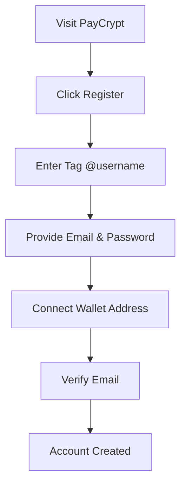
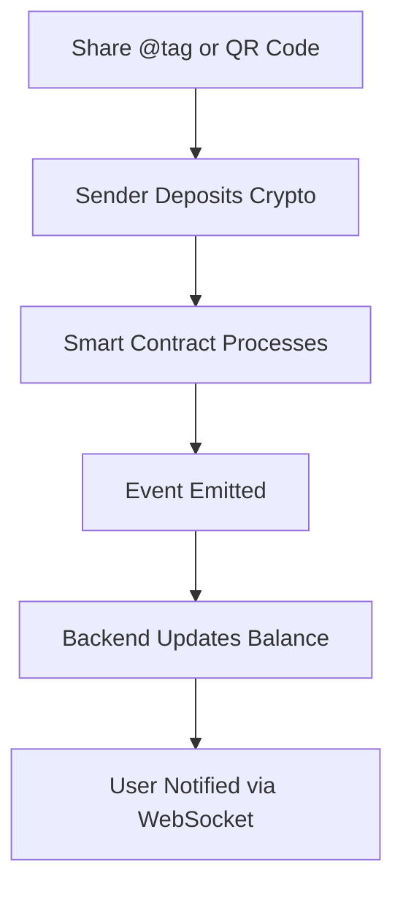
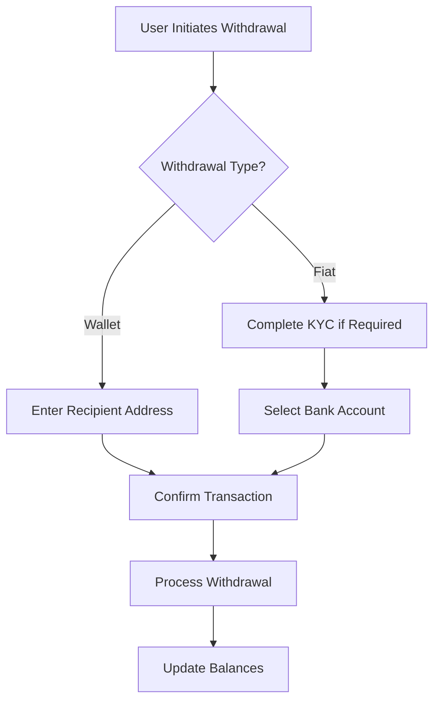
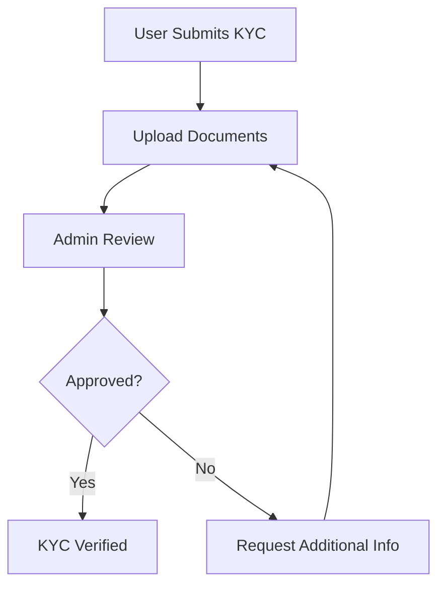

# PayCrypt - Smart Contract Payment System

<div align="center">
  
  
  
  
  
</div>

<div align="center">
  <h3>🚀 The Future of Crypto Payments in Africa</h3>
  <p><strong>Send and receive crypto using simple tags like @username</strong></p>
  <p>Multi-chain support • Bill payments • Auto-split • NGN lock • Production-ready MVP</p>
</div>

---

## 📋 Table of Contents

- [Overview](#-overview)
- [Features](#-features)
- [Tech Stack](#-tech-stack)
- [Architecture](#-architecture)
- [Getting Started](#-getting-started)
- [Project Structure](#-project-structure)
- [User Flows](#-user-flows)
- [API Integration](#-api-integration)
- [Smart Contracts](#-smart-contracts)
- [Security](#-security)
- [Deployment](#-deployment)
- [Contributing](#-contributing)
- [Roadmap](#-roadmap)
- [License](#-license)

---

## 🌟 Overview

PayCrypt is a revolutionary crypto payment system that simplifies digital asset transactions through unique user tags (e.g., `@llins`). Built for the African market with a focus on Nigeria, it bridges the gap between complex crypto addresses and user-friendly payment experiences.

### 🎯 **Core Value Proposition**
- **Simple**: Send crypto using `@username` instead of complex wallet addresses
- **Multi-Chain**: Support for Ethereum, Starknet, Base, and Core networks
- **Local**: Direct NGN conversion via Paystack and Monnify integration
- **Secure**: Smart contract-based with comprehensive KYC and compliance

### 🌍 **Market Focus**
- **Primary Market**: Nigeria (32M crypto users, $56B annual volume)
- **Target Users**: Young professionals, students, small businesses
- **Use Cases**: P2P payments, remittances, e-commerce, freelancer payments

---

## ✨ Features

### 🔐 **Authentication & User Management**
- [x] Secure user registration with unique tag system
- [x] JWT-based authentication with role management
- [x] Password strength validation and security measures
- [x] Multi-factor authentication ready

### 💰 **Core Payment Features**
- [x] **Tag-Based Payments**: Send crypto to `@username` tags
- [x] **Multi-Chain Support**: ETH, STRK, USDC, CORE across 4+ networks
- [x] **Real-Time Balances**: Live balance tracking with WebSocket updates
- [x] **QR Code Payments**: Generate and scan QR codes for easy payments
- [x] **Transaction History**: Comprehensive transaction tracking and filtering

### 🔄 **Advanced Financial Features**
- [x] **Token Swaps**: Built-in DEX integration with best price routing
- [x] **Cross-Chain Transfers**: Bridge assets between supported networks
- [x] **Fiat Off-Ramping**: Convert crypto to NGN via licensed providers
- [x] **Withdrawal Options**: Send to external wallets or bank accounts

### 🏦 **Nigerian Banking Integration**
- [x] **KYC Verification**: Comprehensive identity verification system
- [x] **Bank Account Linking**: Support for major Nigerian banks
- [x] **BVN Integration**: Enhanced verification with Bank Verification Numbers
- [x] **Paystack/Monnify**: Licensed payment processor integration

### 👥 **Admin & Compliance**
- [x] **Admin Dashboard**: System monitoring and user management
- [x] **KYC Management**: Approve/reject verification requests
- [x] **Transaction Monitoring**: Real-time transaction oversight
- [x] **Compliance Tools**: AML/KYC reporting and audit trails
- [x] **Manual Overrides**: Admin controls for large transactions

### 📱 **User Experience**
- [x] **Responsive Design**: Mobile-first, works on all devices
- [x] **Real-Time Updates**: WebSocket integration for live data
- [x] **Progressive Web App**: App-like experience in browsers
- [x] **Accessibility**: WCAG compliant interface design

---

## 🛠 Tech Stack

### **Frontend**
| Technology | Version | Purpose |
|------------|---------|---------|
| **React** | 18.3.1 | UI framework with hooks and context |
| **TypeScript** | 5.5.3 | Type safety and developer experience |
| **Vite** | 5.4.2 | Build tool and development server |
| **Tailwind CSS** | 3.4.1 | Utility-first styling framework |
| **React Hook Form** | 7.62.0 | Form handling and validation |
| **Lucide React** | 0.344.0 | Modern icon library |
| **Recharts** | 3.1.0 | Data visualization and charts |
| **Socket.io Client** | 4.8.1 | Real-time WebSocket communication |

### **Backend (Planned)**
| Technology | Purpose |
|------------|---------|
| **Node.js + Express** | REST API server |
| **MongoDB/PostgreSQL** | Database for user data and transactions |
| **Redis** | Caching and session management |
| **Socket.io** | Real-time WebSocket server |
| **Bull Queue** | Background job processing |

### **Blockchain**
| Technology | Purpose |
|------------|---------|
| **Solidity** | Smart contract development |
| **Hardhat** | Development and testing framework |
| **Ethers.js** | Blockchain interaction library |
| **OpenZeppelin** | Security-audited contract libraries |

### **Third-Party Services**
| Service | Purpose |
|---------|---------|
| **Paystack** | NGN fiat payments |
| **Monnify** | Alternative NGN provider |
| **Uniswap** | Decentralized token swaps |
| **LayerZero** | Cross-chain messaging |
| **Chainlink** | Price feeds and oracles |

---

## 🏗 Architecture

### **System Architecture**
```
┌─────────────────┐    ┌─────────────────┐    ┌─────────────────┐
│   Frontend      │    │   Backend API   │    │ Smart Contracts │
│   (React)       │◄──►│   (Node.js)     │◄──►│   (Solidity)    │
└─────────────────┘    └─────────────────┘    └─────────────────┘
         │                       │                       │
         │                       │                       │
         ▼                       ▼                       ▼
┌─────────────────┐    ┌─────────────────┐    ┌─────────────────┐
│   WebSocket     │    │   Database      │    │   Blockchain    │
│   (Real-time)   │    │   (MongoDB)     │    │   Networks      │
└─────────────────┘    └─────────────────┘    └─────────────────┘
```

### **Smart Contract Architecture**
```solidity
PayCryptCore
├── TagRegistry (User tag management)
├── DepositHandler (Multi-chain deposits)
├── WithdrawalManager (Secure withdrawals)
├── SwapRouter (DEX integration)
└── CrossChainBridge (Inter-chain transfers)
```

### **Database Schema**
```javascript
// Users Collection
{
  _id: ObjectId,
  tag: String (unique),
  email: String,
  walletAddress: String,
  kycStatus: Enum,
  createdAt: Date,
  role: Enum
}

// Transactions Collection
{
  _id: ObjectId,
  userId: ObjectId,
  type: Enum,
  amount: Number,
  token: String,
  chain: String,
  status: Enum,
  txHash: String,
  timestamp: Date
}
```

---

## 🚀 Getting Started

### **Prerequisites**
- Node.js 18+ and npm/yarn
- Git for version control
- Modern web browser
- (Optional) MetaMask or Web3 wallet

### **Installation**

1. **Clone the repository**
   ```bash
   git clone https://github.com/your-org/paycrypt.git
   cd paycrypt
   ```

2. **Install dependencies**
   ```bash
   npm install
   # or
   yarn install
   ```

3. **Environment setup**
   ```bash
   cp .env.example .env
   # Edit .env with your configuration
   ```

4. **Start development server**
   ```bash
   npm run dev
   # or
   yarn dev
   ```

5. **Open in browser**
   ```
   http://localhost:5173
   ```

### **Environment Variables**
```bash
# Frontend Configuration
VITE_API_URL=http://localhost:3001
VITE_WS_URL=ws://localhost:3001
VITE_ENVIRONMENT=development

# Blockchain Configuration
VITE_ETHEREUM_RPC=https://mainnet.infura.io/v3/YOUR_KEY
VITE_STARKNET_RPC=https://alpha-mainnet.starknet.io
VITE_BASE_RPC=https://mainnet.base.org
VITE_CORE_RPC=https://rpc.coredao.org

# Third-Party Services
VITE_PAYSTACK_PUBLIC_KEY=pk_test_xxx
VITE_MONNIFY_API_KEY=MK_TEST_xxx
```

### **Demo Credentials**
```bash
# Regular User
Email: user@example.com
Password: password123

# Admin User  
Email: admin@example.com
Password: admin123
```

---

## 📁 Project Structure

```
paycrypt/
├── public/                 # Static assets
├── src/
│   ├── components/         # React components
│   │   ├── Auth/          # Authentication components
│   │   ├── Dashboard/     # Dashboard components
│   │   ├── Layout/        # Layout components
│   │   ├── Admin/         # Admin panel components
│   │   ├── KYC/           # KYC verification
│   │   └── ...
│   ├── contexts/          # React contexts
│   ├── hooks/             # Custom React hooks
│   ├── types/             # TypeScript type definitions
│   ├── utils/             # Utility functions
│   └── main.tsx           # Application entry point
├── contracts/             # Smart contracts (Solidity)
├── backend/               # Backend API (Node.js)
├── docs/                  # Documentation
├── tests/                 # Test files
└── deployment/            # Deployment scripts
```

### **Key Components**

#### **Authentication System**
- `AuthContext.tsx` - Global authentication state
- `LoginForm.tsx` - User login interface
- `RegisterForm.tsx` - User registration with tag validation

#### **Core Features**
- `UserDashboard.tsx` - Main user interface
- `BalancesView.tsx` - Multi-chain balance display
- `WithdrawView.tsx` - Withdrawal interface (wallet/fiat)
- `SwapView.tsx` - Token swap functionality
- `QRCodeGenerator.tsx` - QR code generation and sharing

#### **Admin Panel**
- `AdminDashboard.tsx` - System overview and analytics
- `AdminUsers.tsx` - User management and KYC approval
- `AdminPayouts.tsx` - Fiat payout monitoring

---

## 👤 User Flows

### **1. User Registration Flow**


### **2. Receiving Crypto Flow**


### **3. Withdrawal Flow**


### **4. KYC Verification Flow**


---

## 🔌 API Integration

### **REST API Endpoints**

#### **Authentication**
```typescript
POST /api/auth/register
POST /api/auth/login
POST /api/auth/logout
GET  /api/auth/profile
```

#### **User Management**
```typescript
GET    /api/users/profile
PUT    /api/users/profile
POST   /api/users/kyc
GET    /api/users/kyc/status
```

#### **Balances & Transactions**
```typescript
GET    /api/balances
GET    /api/transactions
POST   /api/transactions/withdraw
POST   /api/transactions/swap
```

#### **Admin Endpoints**
```typescript
GET    /api/admin/users
PUT    /api/admin/users/:id/kyc
GET    /api/admin/transactions
GET    /api/admin/analytics
```

### **WebSocket Events**
```typescript
// Client → Server
'authenticate' - User authentication
'subscribe_balance' - Subscribe to balance updates
'subscribe_transactions' - Subscribe to transaction updates

// Server → Client
'balance_update' - Real-time balance changes
'transaction_update' - Transaction status changes
'system_alert' - Important system notifications
```

### **Integration Examples**

#### **Frontend API Call**
```typescript
// Balance fetching
const fetchBalances = async () => {
  const response = await fetch('/api/balances', {
    headers: {
      'Authorization': `Bearer ${token}`,
      'Content-Type': 'application/json'
    }
  });
  return response.json();
};
```

#### **WebSocket Integration**
```typescript
// Real-time updates
const socket = io('ws://localhost:3001');
socket.on('balance_update', (data) => {
  updateUserBalance(data);
});
```

---

## 📜 Smart Contracts

### **Core Contracts**

#### **PayCryptCore.sol**
```solidity
pragma solidity ^0.8.19;

contract PayCryptCore {
    mapping(bytes32 => address) public tagToOwner;
    mapping(bytes32 => mapping(address => uint256)) public balances;
    
    event TagRegistered(bytes32 indexed tag, address indexed owner);
    event FundsReceived(bytes32 indexed tag, address token, uint256 amount);
    event Withdrawn(bytes32 indexed tag, address token, uint256 amount);
    
    function registerTag(bytes32 tag) external;
    function depositFor(bytes32 tag) external payable;
    function depositTokenFor(bytes32 tag, address token, uint256 amount) external;
    function withdraw(bytes32 tag, address token, uint256 amount) external;
}
```

#### **Security Features**
- **Reentrancy Protection**: OpenZeppelin's ReentrancyGuard
- **Access Control**: Role-based permissions
- **Pause Mechanism**: Emergency stop functionality
- **Upgrade Pattern**: Proxy contracts for future updates

#### **Multi-Chain Deployment**
```bash
# Ethereum Mainnet
Contract: 0x...
Explorer: https://etherscan.io/address/0x...

# Starknet
Contract: 0x...
Explorer: https://starkscan.co/contract/0x...

# Base
Contract: 0x...
Explorer: https://basescan.org/address/0x...

# Core
Contract: 0x...
Explorer: https://scan.coredao.org/address/0x...
```

---

## 🔒 Security

### **Smart Contract Security**
- ✅ **Audited Libraries**: OpenZeppelin contracts
- ✅ **Reentrancy Protection**: All external calls protected
- ✅ **Access Controls**: Role-based permissions
- ✅ **Input Validation**: Comprehensive parameter checking
- ✅ **Emergency Pause**: Circuit breaker mechanism

### **Frontend Security**
- ✅ **XSS Protection**: Content Security Policy headers
- ✅ **CSRF Protection**: Token-based validation
- ✅ **Input Sanitization**: All user inputs validated
- ✅ **Secure Storage**: Sensitive data encrypted
- ✅ **HTTPS Only**: All communications encrypted

### **Backend Security**
- ✅ **JWT Authentication**: Secure token-based auth
- ✅ **Rate Limiting**: API abuse prevention
- ✅ **Input Validation**: Schema-based validation
- ✅ **SQL Injection**: Parameterized queries
- ✅ **Environment Secrets**: Secure config management

### **Compliance & KYC**
- ✅ **Data Protection**: GDPR/NDPR compliant
- ✅ **KYC Verification**: Identity document validation
- ✅ **AML Monitoring**: Transaction pattern analysis
- ✅ **Audit Trails**: Comprehensive logging
- ✅ **Regulatory Reporting**: Automated compliance reports

---

## 🚀 Deployment

### **Frontend Deployment**

#### **Netlify (Recommended)**
```bash
# Build for production
npm run build

# Deploy to Netlify
netlify deploy --prod --dir=dist
```

#### **Vercel**
```bash
# Install Vercel CLI
npm i -g vercel

# Deploy
vercel --prod
```

#### **AWS S3 + CloudFront**
```bash
# Build and sync to S3
npm run build
aws s3 sync dist/ s3://your-bucket-name
```

### **Backend Deployment**

#### **Railway**
```bash
# Connect to Railway
railway login
railway link

# Deploy
railway up
```

#### **Heroku**
```bash
# Create Heroku app
heroku create paycrypt-api

# Deploy
git push heroku main
```

#### **Docker**
```dockerfile
FROM node:18-alpine
WORKDIR /app
COPY package*.json ./
RUN npm ci --only=production
COPY . .
EXPOSE 3001
CMD ["npm", "start"]
```

### **Smart Contract Deployment**
```bash
# Install Hardhat
npm install --save-dev hardhat

# Deploy to networks
npx hardhat run scripts/deploy.js --network ethereum
npx hardhat run scripts/deploy.js --network base
npx hardhat run scripts/deploy.js --network core
```

### **Environment Configuration**
```bash
# Production Environment Variables
NODE_ENV=production
DATABASE_URL=mongodb://...
REDIS_URL=redis://...
JWT_SECRET=your-secret-key
PAYSTACK_SECRET_KEY=sk_live_...
MONNIFY_SECRET_KEY=...
```

---

## 🤝 Contributing

We welcome contributions from the community! Here's how to get started:

### **Development Setup**
1. Fork the repository
2. Create a feature branch: `git checkout -b feature/amazing-feature`
3. Make your changes and test thoroughly
4. Commit with conventional commits: `git commit -m "feat: add amazing feature"`
5. Push to your branch: `git push origin feature/amazing-feature`
6. Open a Pull Request

### **Code Standards**
- **TypeScript**: Strict mode enabled
- **ESLint**: Airbnb configuration
- **Prettier**: Consistent code formatting
- **Husky**: Pre-commit hooks for quality
- **Jest**: Unit and integration tests

### **Commit Convention**
```bash
feat: new feature
fix: bug fix
docs: documentation changes
style: formatting changes
refactor: code refactoring
test: adding tests
chore: maintenance tasks
```

### **Pull Request Process**
1. Update documentation for any new features
2. Add tests for new functionality
3. Ensure all tests pass
4. Update the README if needed
5. Request review from maintainers

---

## 🗺 Roadmap

### **Phase 1: MVP (Q1 2024)** ✅
- [x] Core frontend application
- [x] User authentication system
- [x] Basic payment flows
- [x] Admin dashboard
- [x] KYC integration

### **Phase 2: Smart Contracts (Q2 2024)**
- [ ] Deploy core smart contracts
- [ ] Multi-chain integration
- [ ] Security audits
- [ ] Testnet deployment

### **Phase 3: Backend Integration (Q2 2024)**
- [ ] REST API development
- [ ] Database integration
- [ ] WebSocket implementation
- [ ] Third-party API integration

### **Phase 4: Production Launch (Q3 2024)**
- [ ] Paystack/Monnify integration
- [ ] Mainnet deployment
- [ ] User onboarding
- [ ] Marketing campaign

### **Phase 5: Scale & Expand (Q4 2024)**
- [ ] Additional chains (Polygon, Arbitrum)
- [ ] Advanced trading features
- [ ] Mobile applications
- [ ] Regional expansion

### **Future Features**
- [ ] DeFi yield farming integration
- [ ] NFT marketplace
- [ ] Merchant payment tools
- [ ] API for third-party developers
- [ ] Multi-currency support (GHS, KES, ZAR)

---

## 📊 Analytics & Monitoring

### **Key Metrics**
- **User Growth**: Daily/Monthly Active Users
- **Transaction Volume**: USD value processed
- **Conversion Rates**: Registration to first transaction
- **Revenue Metrics**: Fees collected, ARPU
- **Technical Metrics**: Uptime, response times

### **Monitoring Tools**
- **Frontend**: Sentry for error tracking
- **Backend**: DataDog for performance monitoring
- **Smart Contracts**: Tenderly for transaction analysis
- **Business**: Mixpanel for user analytics

---

## 📄 License

This project is licensed under the MIT License - see the [LICENSE](LICENSE) file for details.

---

## 🙏 Acknowledgments

- **OpenZeppelin** for secure smart contract libraries
- **Uniswap** for DEX integration protocols
- **Paystack** for Nigerian payment infrastructure
- **React Team** for the amazing frontend framework
- **Tailwind CSS** for the utility-first styling approach

---

## 📞 Support & Contact

### **Community**
- **Discord**: [Join our community](https://discord.gg/paycrypt)
- **Telegram**: [@PayCryptOfficial](https://t.me/PayCryptOfficial)
- **Twitter**: [@PayCryptAfrica](https://twitter.com/PayCryptAfrica)

### **Business Inquiries**
- **Email**: hello@paycrypt.africa
- **Website**: [www.paycrypt.africa](https://www.paycrypt.africa)
- **LinkedIn**: [PayCrypt](https://linkedin.com/company/paycrypt)

### **Technical Support**
- **GitHub Issues**: [Report bugs](https://github.com/paycrypt/paycrypt/issues)
- **Documentation**: [docs.paycrypt.africa](https://docs.paycrypt.africa)
- **Developer Email**: dev@paycrypt.africa

---

<div align="center">
  <h3>🚀 Built with ❤️ for the African crypto community</h3>
  <p><strong>Making crypto payments as easy as sending a text message</strong></p>
  
  [](https://github.com/paycrypt/paycrypt)
  [](https://twitter.com/PayCryptAfrica)
</div>